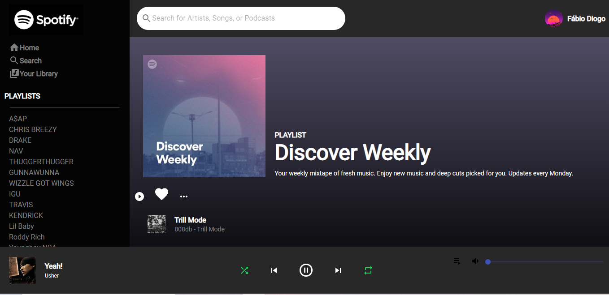

# Portifólio com React e TypeScript

Link para aceso na web (deploy): Ainds não disponível

# Como surgiu a ideia do projeto?

Surgiu da ideia de realizar um projeto autoral para praticar minhas skills e tambem a criativiade de um projeto criado do zero .

## Sobre o projeto

Dessa vez, como tentei realizar um projeto autoral, fiz um projeto com um aplicativo que esta presente da hora que eu acordo ate a hora que vou dormir hehehe.

O clone autentica com a minha conta do Spotify ja pre-configurada, e para esse inicio do projeto , o clone retorna as minhas playlists e as musicas da playlist genérica de " Descobertas da Semana" na parte principal.

Estarei adicionando a responsividade no projeto e melhorando ele para reproduzir musicas.

## Tecnologias presentes

HTML, CSS, JavaScript, ReactJs, Next.js

### 01. Rodando o Projeto
Primeiramente va ao terminal do projeto e execute o comando "npm i" para instalar todas as dependencias de uma vez.
Para rodar o projeto, utilize o comando "npm start" no terminal.

### 02. Dependencias/bibliotecas utilizadas

Para instalar todas as dependencias, somente é necessário executar o comando "npm i" no teminal.
E para rodar o mesmo, deve ser utilizar o comando "npm run dev.

## Criado por

Criado por mim Fabio Diogo. 
